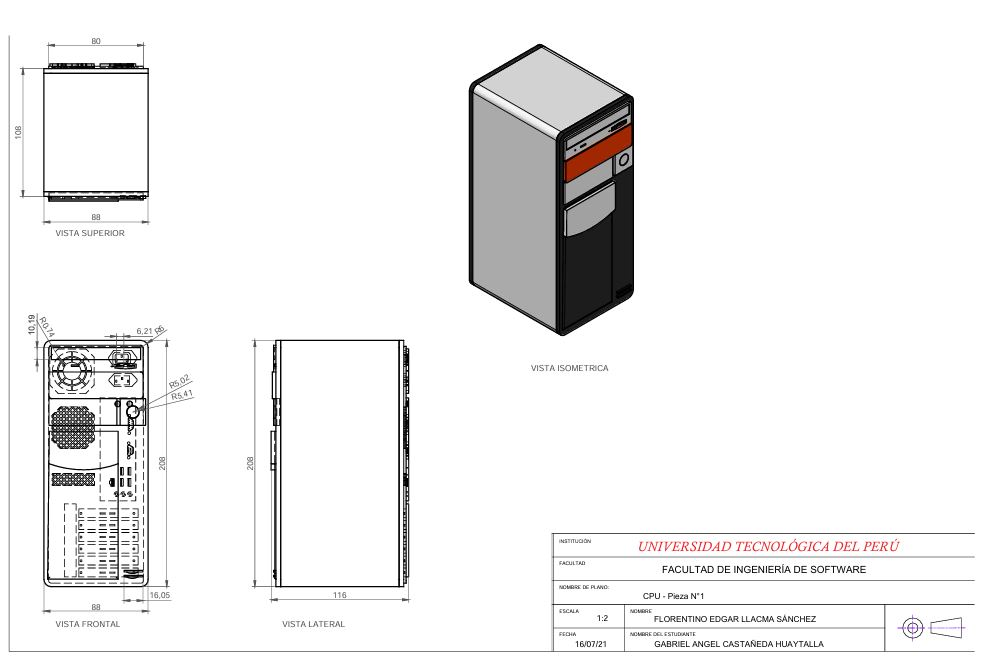
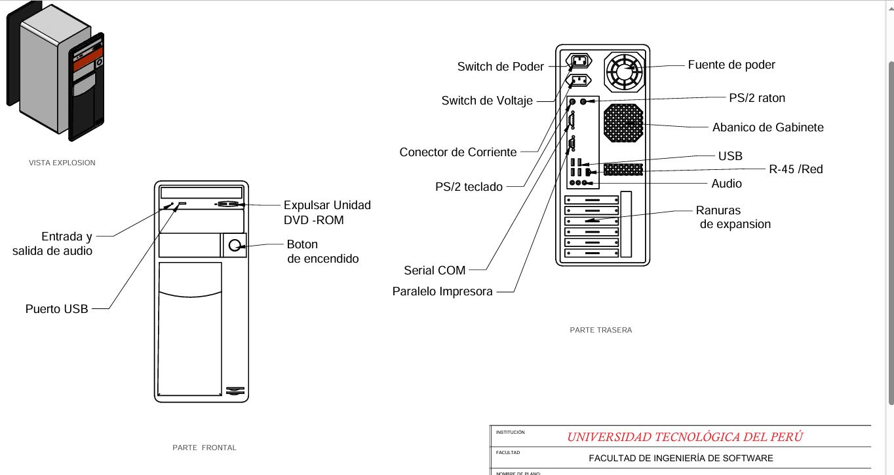
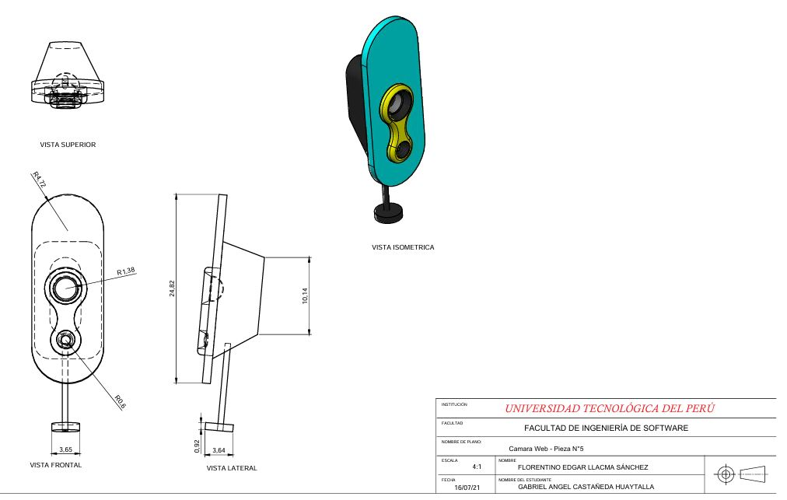
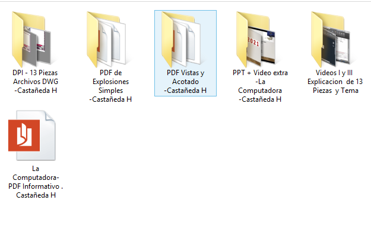

# 🛠️ Modelado 3D en AutoCAD — Explosiones y Acotado de 14 Piezas

**Resumen:**  
Proyecto de modelado 3D en **AutoCAD**, enfocado en la creación, acotado y presentación de **14 piezas técnicas** (ejemplos: CPU, audífonos, USB, entre otros).  
Incluye la generación de **planos detallados**, vistas explosionadas y cotas precisas para su análisis y documentación.

**Tecnologías:** AutoCAD · Diseño Técnico 3D · Planimetría

---

## 🎥 Demo (imágenes / planos)

  
  
  
  

---

## 🎯 Objetivos

**Objetivo general:**  
Modelar y documentar piezas técnicas en 3D utilizando AutoCAD, aplicando técnicas de acotado y explosión.

**Objetivos específicos:**  
* Diseñar y modelar **14 piezas** representativas en 3D.  
* Realizar **explosiones** para mostrar la relación de componentes.  
* Elaborar **planos acotados** con medidas precisas.  
* Facilitar la **interpretación técnica** para ingeniería y manufactura.  

---

## ✨ Características clave

* Modelado en 3D de piezas como **CPU, audífonos, USB, entre otros**.  
* **Vistas explosionadas** para entender la composición de cada objeto.  
* **Planos acotados** para documentar medidas y proporciones.  
* Enfoque en el **diseño técnico profesional** con AutoCAD.  

---

## 📂 Estructura del repo

* `assets/` → imágenes de las piezas, explosiones y planos acotados.  

---

## 🔒 Código / Archivos

Los archivos de diseño en **AutoCAD (.dwg, .dxf)** se mantienen en un **repositorio privado**.  

---

## 📬 Contacto

Para acceder a ejemplos de planos o los archivos completos, contáctame en: [tu.email@ejemplo.com](mailto:tu.email@ejemplo.com)
